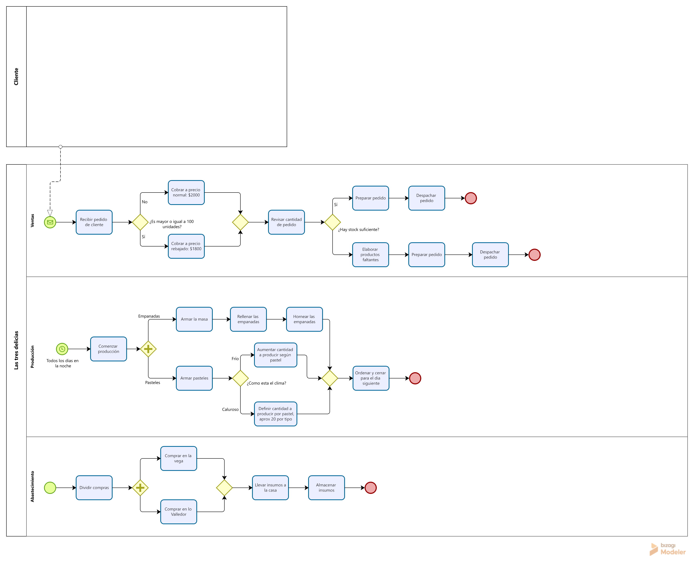
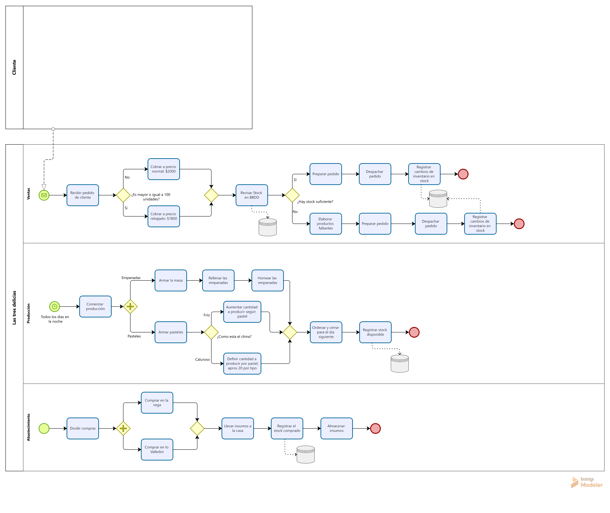

# Diagramas del proyecto

En esta carpeta se encuentran los diagramas utilizados para representar el funcionamiento actual y la solución propuesta para Las 3 Delicias.

## BPMN AS-IS

El diagrama AS-IS representa el funcionamiento actual de la PYME, donde el control del inventario depende principalmente de la revisión visual y experiencia de los trabajadores.

## BPMN TO-BE

El diagrama TO-BE representa el funcionamiento propuesto después de incorporar el sistema de información.

El principal cambio corresponde a la incorporación de registros digitales asociados a las materias primas, compras y movimientos de inventario, permitiendo centralizar la información y mantener actualizado el stock.

